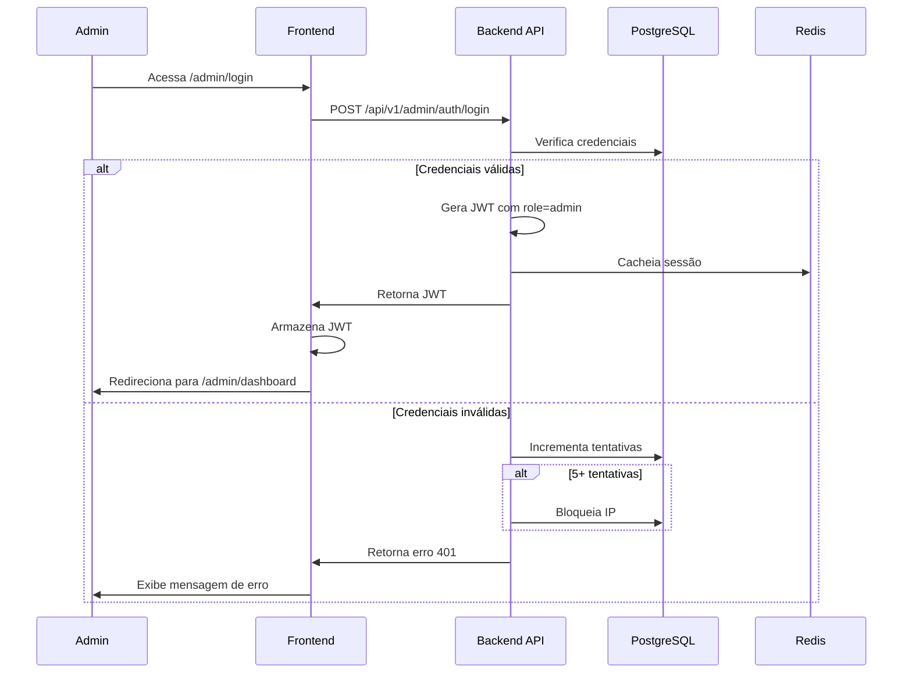

# Design Document - FASE 16: Painel Admin Completo

## Overview

Este documento descreve o design técnico do painel administrativo completo para o SaaS de WhatsApp AI Bot. O painel fornecerá uma interface web centralizada para gerenciar todos os aspectos do negócio: clientes, vendas, suporte, tutoriais, segurança e monitoramento.

### Objetivos do Design

1. **Centralização**: Interface única para todas as operações administrativas
2. **Segurança**: Autenticação robusta, autorização baseada em roles, auditoria completa
3. **Visibilidade**: Métricas em tempo real, dashboards, relatórios
4. **Eficiência**: Automação de tarefas repetitivas, notificações proativas
5. **Escalabilidade**: Arquitetura que suporta crescimento do negócio

### Tecnologias Utilizadas

- **Backend**: FastAPI, SQLAlchemy, PostgreSQL, Redis, Celery
- **Frontend**: Next.js 14, React, Tailwind CSS, Recharts
- **Autenticação**: JWT com bcrypt para hashing de senhas
- **Relatórios**: ReportLab (PDF), openpyxl (Excel)
- **Monitoramento**: psutil para métricas de sistema

## Architecture

### Camadas da Aplicação

```
┌─────────────────────────────────────────────────────────┐
│                    Frontend (Next.js)                    │
│  ┌──────────┐  ┌──────────┐  ┌──────────┐  ┌─────────┐ │
│  │Dashboard │  │ Clientes │  │ Tickets  │  │Relatórios│ │
│  └──────────┘  └──────────┘  └──────────┘  └─────────┘ │
└─────────────────────────────────────────────────────────┘
                          │
                    HTTPS/REST API
                          │
┌─────────────────────────────────────────────────────────┐
│                  Backend API (FastAPI)                   │
│  ┌──────────┐  ┌──────────┐  ┌──────────┐  ┌─────────┐ │
│  │  Auth    │  │ Admin    │  │ Reports  │  │ Monitor │ │
│  │ Service  │  │ Service  │  │ Service  │  │ Service │ │
│  └──────────┘  └──────────┘  └──────────┘  └─────────┘ │
└─────────────────────────────────────────────────────────┘
                          │
              ┌───────────┼───────────┐
              │           │           │
         PostgreSQL    Redis     ChromaDB
```

### Fluxo de Autenticação



### Isolamento de Dados

O painel administrativo opera em um namespace completamente separado:

- **Rotas**: Todas as rotas admin começam com `/api/v1/admin/`
- **Autenticação**: JWT com `role=admin` obrigatório
- **Middleware**: `AdminAuthMiddleware` valida role em todas as requisições
- **Banco de Dados**: Tabelas admin separadas (admins, audit_log, notificacoes_admin)

## Components and Interfaces

### Backend Components

#### 1. AdminAuthService

Responsável por autenticação e autorização de administradores.

```python
class AdminAuthService:
    def __init__(self, db: Session, redis: Redis):
        self.db = db
        self.redis = redis
    
    def authenticate(self, email: str, password: str, ip: str) -> Optional[Admin]:
        """Autentica admin e retorna objeto ou None"""
        pass
    
    def generate_token(self, admin: Admin) -> str:
        """Gera JWT com role=admin"""
        pass
    
    def verify_token(self, token: str) -> Optional[Admin]:
        """Valida JWT e retorna admin"""
        pass
    
    def check_ip_blocked(self, ip: str) -> bool:
        """Verifica se IP está bloqueado"""
        pass
    
    def record_login_attempt(self, email: str, ip: str, success: bool):
        """Registra tentativa de login"""
        pass
    
    def block_ip(self, ip: str, duration_minutes: int = 60):
        """Bloqueia IP por período"""
        pass
```

#### 2. DashboardService

Calcula e fornece métricas de negócio.

```python
class DashboardService:
    def __init__(self, db: Session, redis: Redis):
        self.db = db
        self.redis = redis
        self.cache_ttl = 300  # 5 minutos
    
    def get_metrics(self) -> DashboardMetrics:
        """Retorna métricas principais com cache"""
        pass
    
    def get_sales_chart(self, days: int = 30) -> List[DailySales]:
        """Retorna vendas por dia"""
        pass
    
    def get_revenue_chart(self, months: int = 6) -> List[MonthlyRevenue]:
        """Retorna receita mensal"""
        pass
    
    def get_recent_clients(self, limit: int = 5) -> List[Cliente]:
        """Retorna clientes mais recentes"""
        pass
    
    def calculate_mrr(self) -> Decimal:
        """Calcula Monthly Recurring Revenue"""
        pass
    
    def calculate_conversion_rate(self) -> float:
        """Calcula taxa de conversão"""
        pass
```


#### 3. ClienteAdminService

Gerencia operações administrativas sobre clientes.

```python
class ClienteAdminService:
    def __init__(self, db: Session, audit_service: AuditService):
        self.db = db
        self.audit = audit_service
    
    def list_clientes(self, filters: ClienteFilters, page: int, size: int) -> PaginatedResult:
        """Lista clientes com filtros e paginação"""
        pass
    
    def get_cliente_details(self, cliente_id: int) -> ClienteDetails:
        """Retorna detalhes completos do cliente"""
        pass
    
    def update_cliente(self, admin_id: int, cliente_id: int, data: ClienteUpdate) -> Cliente:
        """Atualiza dados do cliente e registra auditoria"""
        pass
    
    def suspend_cliente(self, admin_id: int, cliente_id: int, reason: str):
        """Suspende cliente e registra auditoria"""
        pass
    
    def activate_cliente(self, admin_id: int, cliente_id: int):
        """Ativa cliente suspenso e registra auditoria"""
        pass
    
    def reset_password(self, admin_id: int, cliente_id: int) -> str:
        """Gera nova senha temporária e envia email"""
        pass
```

#### 4. UsageMonitorService

Monitora uso da API OpenAI por cliente.

```python
class UsageMonitorService:
    def __init__(self, db: Session):
        self.db = db
        self.openai_pricing = {
            "gpt-4": {"input": 0.03, "output": 0.06},  # por 1K tokens
            "gpt-3.5-turbo": {"input": 0.0015, "output": 0.002}
        }
    
    def record_usage(self, cliente_id: int, model: str, input_tokens: int, output_tokens: int):
        """Registra uso e calcula custo"""
        pass
    
    def get_top_spenders(self, limit: int = 10) -> List[ClienteUsage]:
        """Retorna clientes com maior gasto"""
        pass
    
    def get_cliente_usage(self, cliente_id: int, days: int = 30) -> List[DailyUsage]:
        """Retorna histórico de uso do cliente"""
        pass
    
    def get_alerts(self) -> List[UsageAlert]:
        """Retorna alertas de uso excessivo"""
        pass
    
    def calculate_cost(self, model: str, input_tokens: int, output_tokens: int) -> Decimal:
        """Calcula custo estimado"""
        pass
```

#### 5. TicketService

Gerencia sistema de tickets de suporte.

```python
class TicketService:
    def __init__(self, db: Session, rag_service: RAGService, email_service: EmailService):
        self.db = db
        self.rag = rag_service
        self.email = email_service
        self.auto_response_threshold = 0.7
    
    def create_ticket(self, cliente_id: int, data: TicketCreate) -> Ticket:
        """Cria ticket e tenta resposta automática"""
        pass
    
    def try_auto_response(self, ticket: Ticket) -> Optional[str]:
        """Tenta responder automaticamente usando RAG"""
        pass
    
    def list_tickets(self, filters: TicketFilters, page: int, size: int) -> PaginatedResult:
        """Lista tickets com filtros"""
        pass
    
    def add_response(self, admin_id: int, ticket_id: int, message: str):
        """Adiciona resposta do admin e notifica cliente"""
        pass
    
    def update_status(self, admin_id: int, ticket_id: int, status: TicketStatus):
        """Atualiza status do ticket"""
        pass
    
    def categorize_ticket(self, content: str) -> str:
        """Categoriza ticket usando IA"""
        pass
```

#### 6. TutorialService

Gerencia tutoriais em vídeo.

```python
class TutorialService:
    def __init__(self, db: Session, notification_service: NotificationService):
        self.db = db
        self.notifications = notification_service
    
    def create_tutorial(self, admin_id: int, data: TutorialCreate) -> Tutorial:
        """Cria tutorial e notifica clientes"""
        pass
    
    def update_tutorial(self, admin_id: int, tutorial_id: int, data: TutorialUpdate) -> Tutorial:
        """Atualiza tutorial"""
        pass
    
    def reorder_tutorials(self, admin_id: int, order: List[int]):
        """Reordena tutoriais"""
        pass
    
    def record_view(self, cliente_id: int, tutorial_id: int):
        """Registra visualização"""
        pass
    
    def add_comment(self, cliente_id: int, tutorial_id: int, content: str):
        """Adiciona comentário"""
        pass
    
    def get_statistics(self, tutorial_id: int) -> TutorialStats:
        """Retorna estatísticas de visualizações"""
        pass
```


#### 7. AvisoService

Gerencia avisos e anúncios para clientes.

```python
class AvisoService:
    def __init__(self, db: Session):
        self.db = db
    
    def create_aviso(self, admin_id: int, data: AvisoCreate) -> Aviso:
        """Cria aviso"""
        pass
    
    def update_aviso(self, admin_id: int, aviso_id: int, data: AvisoUpdate) -> Aviso:
        """Atualiza aviso"""
        pass
    
    def deactivate_aviso(self, admin_id: int, aviso_id: int):
        """Desativa aviso"""
        pass
    
    def get_active_avisos(self) -> List[Aviso]:
        """Retorna avisos ativos (data_inicio <= hoje <= data_fim)"""
        pass
    
    def preview_aviso(self, data: AvisoCreate) -> str:
        """Gera preview HTML do aviso"""
        pass
```

#### 8. ReportService

Gera relatórios em PDF e Excel.

```python
class ReportService:
    def __init__(self, db: Session, storage_path: str):
        self.db = db
        self.storage_path = storage_path
    
    def generate_sales_report(self, filters: ReportFilters, format: str) -> str:
        """Gera relatório de vendas (PDF ou Excel)"""
        pass
    
    def generate_clients_report(self, filters: ReportFilters, format: str) -> str:
        """Gera relatório de clientes"""
        pass
    
    def generate_usage_report(self, filters: ReportFilters, format: str) -> str:
        """Gera relatório de uso OpenAI"""
        pass
    
    def generate_tickets_report(self, filters: ReportFilters, format: str) -> str:
        """Gera relatório de tickets"""
        pass
    
    def save_report_history(self, admin_id: int, report_type: str, file_path: str):
        """Salva histórico de relatórios gerados"""
        pass
    
    def cleanup_old_reports(self, days: int = 90):
        """Remove relatórios com mais de X dias"""
        pass
```

#### 9. AuditService

Registra auditoria de ações administrativas.

```python
class AuditService:
    def __init__(self, db: Session):
        self.db = db
    
    def log_action(
        self,
        admin_id: int,
        action: str,
        entity_type: str,
        entity_id: int,
        old_data: Optional[dict],
        new_data: Optional[dict],
        ip: str
    ):
        """Registra ação no audit log"""
        pass
    
    def get_audit_log(self, filters: AuditFilters, page: int, size: int) -> PaginatedResult:
        """Lista audit log com filtros"""
        pass
    
    def get_entity_history(self, entity_type: str, entity_id: int) -> List[AuditLog]:
        """Retorna histórico de uma entidade"""
        pass
```

#### 10. NotificationService

Gerencia notificações para administradores.

```python
class NotificationService:
    def __init__(self, db: Session):
        self.db = db
    
    def create_notification(
        self,
        type: NotificationType,
        title: str,
        message: str,
        priority: str = "normal",
        data: Optional[dict] = None
    ):
        """Cria notificação para todos os admins"""
        pass
    
    def get_notifications(self, admin_id: int, unread_only: bool = False) -> List[Notification]:
        """Lista notificações do admin"""
        pass
    
    def mark_as_read(self, admin_id: int, notification_id: int):
        """Marca notificação como lida"""
        pass
    
    def get_unread_count(self, admin_id: int) -> int:
        """Retorna contador de não lidas"""
        pass
```

#### 11. SystemMonitorService

Monitora saúde do sistema e serviços.

```python
class SystemMonitorService:
    def __init__(self, db: Session, redis: Redis, chroma_client, evolution_api_url: str):
        self.db = db
        self.redis = redis
        self.chroma = chroma_client
        self.evolution_url = evolution_api_url
    
    def check_health(self) -> SystemHealth:
        """Verifica saúde de todos os serviços"""
        pass
    
    def get_metrics(self) -> SystemMetrics:
        """Coleta métricas de sistema"""
        pass
    
    def check_postgresql(self) -> ServiceStatus:
        """Verifica conectividade PostgreSQL"""
        pass
    
    def check_redis(self) -> ServiceStatus:
        """Verifica conectividade Redis"""
        pass
    
    def check_chromadb(self) -> ServiceStatus:
        """Verifica conectividade ChromaDB"""
        pass
    
    def check_evolution_api(self) -> ServiceStatus:
        """Verifica conectividade Evolution API"""
        pass
    
    def check_openai(self) -> ServiceStatus:
        """Verifica conectividade OpenAI"""
        pass
    
    def collect_system_metrics(self) -> dict:
        """Coleta CPU, memória, disco usando psutil"""
        pass
```


### Frontend Components

#### 1. Layout Components

```typescript
// AdminLayout.tsx
interface AdminLayoutProps {
  children: React.ReactNode;
}

// Sidebar com navegação
// Header com notificações e perfil
// Responsivo: colapsa em mobile
```

#### 2. Dashboard Components

```typescript
// MetricsCards.tsx - Cards com métricas principais
// SalesChart.tsx - Gráfico de vendas (Recharts)
// RevenueChart.tsx - Gráfico de receita (Recharts)
// RecentClients.tsx - Lista de clientes recentes
```

#### 3. Cliente Management Components

```typescript
// ClientesTable.tsx - Tabela com filtros e paginação
// ClienteDetails.tsx - Página de detalhes do cliente
// ClienteActions.tsx - Botões de ação (suspender, ativar, resetar senha)
// ClienteFilters.tsx - Formulário de filtros
```

#### 4. Ticket Components

```typescript
// TicketsTable.tsx - Lista de tickets
// TicketChat.tsx - Interface de chat para responder
// TicketFilters.tsx - Filtros de tickets
```

#### 5. Tutorial Components

```typescript
// TutorialsGrid.tsx - Grid de vídeos
// TutorialForm.tsx - Formulário criar/editar
// TutorialPlayer.tsx - Player de vídeo
// TutorialComments.tsx - Seção de comentários
```

#### 6. Report Components

```typescript
// ReportFilters.tsx - Formulário de filtros
// ReportPreview.tsx - Preview do relatório
// ReportHistory.tsx - Histórico de relatórios gerados
```

#### 7. Security Components

```typescript
// LoginAttempts.tsx - Tabela de tentativas de login
// BlockedIPs.tsx - Lista de IPs bloqueados
// AuditLog.tsx - Tabela de audit log
```

#### 8. Notification Components

```typescript
// NotificationBell.tsx - Ícone sino com badge
// NotificationDropdown.tsx - Dropdown com notificações
// NotificationList.tsx - Página de histórico
```

#### 9. System Monitor Components

```typescript
// HealthCards.tsx - Cards de status dos serviços
// MetricsCharts.tsx - Gráficos de métricas
// AlertsList.tsx - Lista de alertas
```

## Data Models

### Database Schema

#### Tabela: admins

```sql
CREATE TABLE admins (
    id SERIAL PRIMARY KEY,
    nome VARCHAR(255) NOT NULL,
    email VARCHAR(255) UNIQUE NOT NULL,
    senha_hash VARCHAR(255) NOT NULL,
    role VARCHAR(50) DEFAULT 'admin',
    tema VARCHAR(20) DEFAULT 'light',
    cliente_especial_id INTEGER REFERENCES clientes(id),
    created_at TIMESTAMP DEFAULT NOW(),
    updated_at TIMESTAMP DEFAULT NOW()
);

CREATE INDEX idx_admins_email ON admins(email);
```

#### Tabela: login_attempts

```sql
CREATE TABLE login_attempts (
    id SERIAL PRIMARY KEY,
    email VARCHAR(255) NOT NULL,
    ip VARCHAR(45) NOT NULL,
    success BOOLEAN NOT NULL,
    user_agent TEXT,
    created_at TIMESTAMP DEFAULT NOW()
);

CREATE INDEX idx_login_attempts_ip ON login_attempts(ip, created_at);
CREATE INDEX idx_login_attempts_email ON login_attempts(email, created_at);
```

#### Tabela: ips_bloqueados

```sql
CREATE TABLE ips_bloqueados (
    id SERIAL PRIMARY KEY,
    ip VARCHAR(45) UNIQUE NOT NULL,
    reason TEXT,
    blocked_at TIMESTAMP DEFAULT NOW(),
    expires_at TIMESTAMP NOT NULL
);

CREATE INDEX idx_ips_bloqueados_ip ON ips_bloqueados(ip);
CREATE INDEX idx_ips_bloqueados_expires ON ips_bloqueados(expires_at);
```

#### Tabela: audit_log

```sql
CREATE TABLE audit_log (
    id SERIAL PRIMARY KEY,
    admin_id INTEGER REFERENCES admins(id),
    action VARCHAR(100) NOT NULL,
    entity_type VARCHAR(50) NOT NULL,
    entity_id INTEGER NOT NULL,
    old_data JSONB,
    new_data JSONB,
    ip VARCHAR(45),
    created_at TIMESTAMP DEFAULT NOW()
);

CREATE INDEX idx_audit_log_admin ON audit_log(admin_id, created_at);
CREATE INDEX idx_audit_log_entity ON audit_log(entity_type, entity_id);
CREATE INDEX idx_audit_log_action ON audit_log(action, created_at);
```


#### Tabela: uso_openai

```sql
CREATE TABLE uso_openai (
    id SERIAL PRIMARY KEY,
    cliente_id INTEGER REFERENCES clientes(id),
    data DATE NOT NULL,
    model VARCHAR(50) NOT NULL,
    input_tokens INTEGER NOT NULL,
    output_tokens INTEGER NOT NULL,
    custo_estimado DECIMAL(10, 4) NOT NULL,
    mensagens_processadas INTEGER DEFAULT 1,
    created_at TIMESTAMP DEFAULT NOW()
);

CREATE INDEX idx_uso_openai_cliente ON uso_openai(cliente_id, data);
CREATE INDEX idx_uso_openai_data ON uso_openai(data);
```

#### Tabela: tickets

```sql
CREATE TABLE tickets (
    id SERIAL PRIMARY KEY,
    cliente_id INTEGER REFERENCES clientes(id),
    titulo VARCHAR(255) NOT NULL,
    descricao TEXT NOT NULL,
    categoria VARCHAR(50),
    status VARCHAR(20) DEFAULT 'ABERTO',
    prioridade VARCHAR(20) DEFAULT 'NORMAL',
    auto_responded BOOLEAN DEFAULT FALSE,
    confidence_score DECIMAL(3, 2),
    created_at TIMESTAMP DEFAULT NOW(),
    updated_at TIMESTAMP DEFAULT NOW(),
    closed_at TIMESTAMP
);

CREATE INDEX idx_tickets_cliente ON tickets(cliente_id);
CREATE INDEX idx_tickets_status ON tickets(status, created_at);
CREATE INDEX idx_tickets_categoria ON tickets(categoria);
```

#### Tabela: ticket_mensagens

```sql
CREATE TABLE ticket_mensagens (
    id SERIAL PRIMARY KEY,
    ticket_id INTEGER REFERENCES tickets(id),
    autor_tipo VARCHAR(20) NOT NULL, -- 'CLIENTE', 'ADMIN', 'IA'
    autor_id INTEGER,
    mensagem TEXT NOT NULL,
    created_at TIMESTAMP DEFAULT NOW()
);

CREATE INDEX idx_ticket_mensagens_ticket ON ticket_mensagens(ticket_id, created_at);
```

#### Tabela: ticket_categorias

```sql
CREATE TABLE ticket_categorias (
    id SERIAL PRIMARY KEY,
    nome VARCHAR(100) UNIQUE NOT NULL,
    descricao TEXT,
    cor VARCHAR(7), -- hex color
    ativo BOOLEAN DEFAULT TRUE
);
```

#### Tabela: tutoriais

```sql
CREATE TABLE tutoriais (
    id SERIAL PRIMARY KEY,
    titulo VARCHAR(255) NOT NULL,
    descricao TEXT,
    video_url TEXT NOT NULL,
    thumbnail_url TEXT,
    categoria VARCHAR(50),
    ordem INTEGER NOT NULL,
    duracao_segundos INTEGER,
    ativo BOOLEAN DEFAULT TRUE,
    created_at TIMESTAMP DEFAULT NOW(),
    updated_at TIMESTAMP DEFAULT NOW()
);

CREATE INDEX idx_tutoriais_ordem ON tutoriais(ordem);
CREATE INDEX idx_tutoriais_categoria ON tutoriais(categoria);
```

#### Tabela: tutorial_visualizacoes

```sql
CREATE TABLE tutorial_visualizacoes (
    id SERIAL PRIMARY KEY,
    tutorial_id INTEGER REFERENCES tutoriais(id),
    cliente_id INTEGER REFERENCES clientes(id),
    progresso_segundos INTEGER DEFAULT 0,
    completado BOOLEAN DEFAULT FALSE,
    created_at TIMESTAMP DEFAULT NOW(),
    updated_at TIMESTAMP DEFAULT NOW(),
    UNIQUE(tutorial_id, cliente_id)
);

CREATE INDEX idx_tutorial_visualizacoes_tutorial ON tutorial_visualizacoes(tutorial_id);
CREATE INDEX idx_tutorial_visualizacoes_cliente ON tutorial_visualizacoes(cliente_id);
```

#### Tabela: tutorial_comentarios

```sql
CREATE TABLE tutorial_comentarios (
    id SERIAL PRIMARY KEY,
    tutorial_id INTEGER REFERENCES tutoriais(id),
    cliente_id INTEGER REFERENCES clientes(id),
    comentario TEXT NOT NULL,
    created_at TIMESTAMP DEFAULT NOW()
);

CREATE INDEX idx_tutorial_comentarios_tutorial ON tutorial_comentarios(tutorial_id, created_at);
```

#### Tabela: avisos

```sql
CREATE TABLE avisos (
    id SERIAL PRIMARY KEY,
    tipo VARCHAR(20) NOT NULL, -- 'info', 'warning', 'error', 'success'
    titulo VARCHAR(255) NOT NULL,
    mensagem TEXT NOT NULL,
    ativo BOOLEAN DEFAULT TRUE,
    data_inicio DATE NOT NULL,
    data_fim DATE NOT NULL,
    created_at TIMESTAMP DEFAULT NOW(),
    updated_at TIMESTAMP DEFAULT NOW()
);

CREATE INDEX idx_avisos_ativo ON avisos(ativo, data_inicio, data_fim);
```

#### Tabela: notificacoes_admin

```sql
CREATE TABLE notificacoes_admin (
    id SERIAL PRIMARY KEY,
    admin_id INTEGER REFERENCES admins(id),
    tipo VARCHAR(50) NOT NULL,
    titulo VARCHAR(255) NOT NULL,
    mensagem TEXT NOT NULL,
    prioridade VARCHAR(20) DEFAULT 'normal',
    lida BOOLEAN DEFAULT FALSE,
    data JSONB,
    created_at TIMESTAMP DEFAULT NOW()
);

CREATE INDEX idx_notificacoes_admin_admin ON notificacoes_admin(admin_id, lida, created_at);
```

#### Tabela: relatorios_historico

```sql
CREATE TABLE relatorios_historico (
    id SERIAL PRIMARY KEY,
    admin_id INTEGER REFERENCES admins(id),
    tipo VARCHAR(50) NOT NULL,
    formato VARCHAR(10) NOT NULL,
    file_path TEXT NOT NULL,
    filtros JSONB,
    created_at TIMESTAMP DEFAULT NOW()
);

CREATE INDEX idx_relatorios_historico_admin ON relatorios_historico(admin_id, created_at);
```

#### Extensões nas Tabelas Existentes

```sql
-- Adicionar campos em clientes
ALTER TABLE clientes ADD COLUMN ultimo_login TIMESTAMP;
ALTER TABLE clientes ADD COLUMN ip_ultimo_login VARCHAR(45);
ALTER TABLE clientes ADD COLUMN total_mensagens_enviadas INTEGER DEFAULT 0;

CREATE INDEX idx_clientes_ultimo_login ON clientes(ultimo_login);
```


### Pydantic Models

```python
from pydantic import BaseModel, EmailStr, Field
from typing import Optional, List
from datetime import datetime, date
from decimal import Decimal

class AdminCreate(BaseModel):
    nome: str
    email: EmailStr
    senha: str
    role: str = "admin"

class AdminLogin(BaseModel):
    email: EmailStr
    senha: str

class AdminResponse(BaseModel):
    id: int
    nome: str
    email: str
    role: str
    tema: str
    created_at: datetime

class DashboardMetrics(BaseModel):
    total_clientes: int
    mrr: Decimal
    novos_mes: int
    cancelamentos_mes: int
    taxa_conversao: float
    ticket_medio: Decimal

class ClienteFilters(BaseModel):
    status: Optional[str] = None
    plano: Optional[str] = None
    data_inicio: Optional[date] = None
    data_fim: Optional[date] = None

class ClienteDetails(BaseModel):
    id: int
    nome: str
    email: str
    status: str
    plano: str
    ultimo_login: Optional[datetime]
    ip_ultimo_login: Optional[str]
    total_mensagens_enviadas: int
    created_at: datetime

class TicketCreate(BaseModel):
    titulo: str
    descricao: str
    categoria: Optional[str] = None

class TicketResponse(BaseModel):
    id: int
    cliente_id: int
    titulo: str
    descricao: str
    categoria: str
    status: str
    auto_responded: bool
    confidence_score: Optional[Decimal]
    created_at: datetime

class TutorialCreate(BaseModel):
    titulo: str
    descricao: str
    video_url: str
    thumbnail_url: Optional[str]
    categoria: str
    ordem: int
    duracao_segundos: Optional[int]

class AvisoCreate(BaseModel):
    tipo: str  # info, warning, error, success
    titulo: str
    mensagem: str
    data_inicio: date
    data_fim: date

class ReportFilters(BaseModel):
    data_inicio: date
    data_fim: date
    cliente_id: Optional[int] = None
    status: Optional[str] = None

class AuditFilters(BaseModel):
    admin_id: Optional[int] = None
    action: Optional[str] = None
    entity_type: Optional[str] = None
    data_inicio: Optional[date] = None
    data_fim: Optional[date] = None

class SystemHealth(BaseModel):
    postgresql: ServiceStatus
    redis: ServiceStatus
    chromadb: ServiceStatus
    evolution_api: ServiceStatus
    openai: ServiceStatus

class ServiceStatus(BaseModel):
    status: str  # healthy, unhealthy, degraded
    message: Optional[str]
    response_time_ms: Optional[int]
```

## Correctness Properties

*A property is a characteristic or behavior that should hold true across all valid executions of a system—essentially, a formal statement about what the system should do. Properties serve as the bridge between human-readable specifications and machine-verifiable correctness guarantees.*

### Property Reflection

After analyzing all acceptance criteria, I identified the following patterns and potential redundancies:

**Authentication & Security Properties (1.x, 9.x)**:
- Properties 1.1-1.6 cover authentication flow
- Properties 9.1-9.6 cover security logging and IP blocking
- These are complementary and non-redundant

**Data Persistence Properties (3.x, 5.x, 6.x, 7.x)**:
- Multiple properties test "create then read" pattern
- Can be consolidated into fewer properties that test general CRUD operations
- Properties 3.3, 12.1, 17.4, 18.4 are all round-trip properties - these are distinct for different data types

**Notification Properties (10.x)**:
- Properties 10.1-10.6 test different notification triggers
- Property 10.7-10.8 test notification state management
- These are complementary and non-redundant

**Filtering Properties (3.1, 5.4, 9.5, 14.1)**:
- Multiple properties test filtering behavior
- These can be consolidated into a general filtering property

**Report Properties (8.x)**:
- Properties 8.1-8.4 test report content
- Properties 8.5-8.6 test file formats
- These are complementary and non-redundant

After reflection, I will consolidate some properties while keeping distinct ones separate.

### Authentication and Authorization Properties

**Property 1: Password Hashing**
*For any* admin password, when stored in the database, the password SHALL be hashed using bcrypt and SHALL NOT be stored in plain text.
**Validates: Requirements 1.1**

**Property 2: JWT Contains Admin Role**
*For any* valid admin credentials, when authentication succeeds, the returned JWT SHALL contain role=admin.
**Validates: Requirements 1.2**

**Property 3: IP Blocking After Failed Attempts**
*For any* IP address, when 5 login attempts fail within 15 minutes, the IP SHALL be blocked for 1 hour.
**Validates: Requirements 1.3**

**Property 4: Admin Role Required for Admin Endpoints**
*For any* JWT without role=admin, when accessing admin endpoints, the request SHALL be denied with 403 status.
**Validates: Requirements 1.4**

**Property 5: Authenticated Admin Profile Retrieval**
*For any* authenticated admin, when accessing GET /api/v1/admin/auth/me, the response SHALL contain the admin's profile data.
**Validates: Requirements 1.6**

### Dashboard and Metrics Properties

**Property 6: Dashboard Metrics Completeness**
*For any* dashboard request, the response SHALL include total_clientes, mrr, novos_mes, cancelamentos_mes, taxa_conversao, and ticket_medio.
**Validates: Requirements 2.1, 2.2**

**Property 7: Sales Chart Data Points**
*For any* sales chart request, the response SHALL contain exactly 30 data points representing the last 30 days.
**Validates: Requirements 2.3**

**Property 8: Revenue Chart Data Points**
*For any* revenue chart request, the response SHALL contain exactly 6 data points representing the last 6 months.
**Validates: Requirements 2.4**

**Property 9: Recent Clients Limit**
*For any* recent clients request, the response SHALL contain at most 5 clients.
**Validates: Requirements 2.5**

**Property 10: Dashboard Metrics Caching**
*For any* dashboard metrics request, when called twice within 5 minutes, the second call SHALL return cached data without recalculation.
**Validates: Requirements 2.6**

### Client Management Properties

**Property 11: Pagination and Filtering**
*For any* list request with pagination parameters and filters, the response SHALL be properly paginated and filtered according to the specified criteria.
**Validates: Requirements 3.1, 5.4, 9.5, 14.1**

**Property 12: Client Details Completeness**
*For any* client details request, the response SHALL include ultimo_login, ip_ultimo_login, and total_mensagens_enviadas.
**Validates: Requirements 3.2**

**Property 13: Client Data Update Round-Trip**
*For any* client, when admin updates client data, reading the client SHALL return the updated data.
**Validates: Requirements 3.3**

**Property 14: Client Suspension State Change**
*For any* active client, when admin suspends the client, the client status SHALL be SUSPENSO and login attempts SHALL fail.
**Validates: Requirements 3.4**

**Property 15: Client Activation State Change**
*For any* suspended client, when admin activates the client, the client status SHALL be ATIVO and login attempts SHALL succeed.
**Validates: Requirements 3.5**

**Property 16: Password Reset Invalidates Old Password**
*For any* client, when admin resets password, the old password SHALL no longer work and a new temporary password SHALL be generated.
**Validates: Requirements 3.6**

**Property 17: Admin Actions Audit Logging**
*For any* critical admin action (suspend, activate, reset password, cancel subscription), an audit log entry SHALL be created.
**Validates: Requirements 3.7, 9.3**

### Usage Monitoring Properties

**Property 18: Usage Recording**
*For any* AI message processing, a usage record SHALL be created with cliente_id, tokens, and estimated cost.
**Validates: Requirements 4.1**

**Property 19: Top Spenders Ordering**
*For any* top spenders request, the response SHALL contain at most 10 clients ordered by cost descending.
**Validates: Requirements 4.2**

**Property 20: Usage Alert Generation**
*For any* client, when usage exceeds configured threshold, an alert SHALL be created.
**Validates: Requirements 4.4**

**Property 21: Cost Calculation Accuracy**
*For any* known token counts and model, the calculated cost SHALL match the OpenAI pricing formula.
**Validates: Requirements 4.5**

### Ticket System Properties

**Property 22: Ticket Creation with Auto-Response**
*For any* ticket creation, the system SHALL attempt auto-response using RAG with confidence threshold 0.7.
**Validates: Requirements 5.1, 5.2**

**Property 23: Low Confidence Tickets Marked for Human**
*For any* ticket with auto-response confidence < 0.7, the ticket SHALL be marked for human attention.
**Validates: Requirements 5.3**

**Property 24: Admin Response Creates Message and Notification**
*For any* admin response to a ticket, a message SHALL be added and the client SHALL be notified by email.
**Validates: Requirements 5.5**

**Property 25: Ticket Status Change Recording**
*For any* ticket status change, the change SHALL be recorded with timestamp.
**Validates: Requirements 5.6**

**Property 26: Auto-Categorization**
*For any* ticket without specified category, a category SHALL be assigned using IA.
**Validates: Requirements 5.7**

### Tutorial System Properties

**Property 27: Tutorial Reordering**
*For any* tutorial reorder operation, the ordem field SHALL reflect the new order.
**Validates: Requirements 6.2**

**Property 28: View Recording**
*For any* tutorial view, a visualization record SHALL be created with timestamp.
**Validates: Requirements 6.3**

**Property 29: Comment Persistence**
*For any* tutorial comment, the comment SHALL be retrievable after creation.
**Validates: Requirements 6.4**

**Property 30: New Tutorial Notifications**
*For any* new tutorial publication, notifications SHALL be sent to all active clients.
**Validates: Requirements 6.5**

### Aviso System Properties

**Property 31: Active Avisos Date Filtering**
*For any* active avisos request, only avisos where data_inicio <= today <= data_fim and ativo=true SHALL be returned.
**Validates: Requirements 7.2, 7.3**

**Property 32: Aviso Deactivation**
*For any* aviso, when admin deactivates it, the aviso SHALL not appear in active avisos list.
**Validates: Requirements 7.5**

**Property 33: Aviso Color Mapping**
*For any* aviso, the color SHALL match the type: info=blue, warning=yellow, error=red, success=green.
**Validates: Requirements 7.4**

### Report Generation Properties

**Property 34: Report Date Filtering**
*For any* report request with date filters, the generated report SHALL only include data within the specified period.
**Validates: Requirements 8.1**

**Property 35: Report Format Validity**
*For any* report generation, if format is PDF, the file SHALL be a valid PDF; if format is Excel, the file SHALL be a valid Excel file.
**Validates: Requirements 8.5, 8.6**

**Property 36: Report Retention**
*For any* report, if it is older than 90 days, it SHALL be deleted.
**Validates: Requirements 8.7**

### Security and Audit Properties

**Property 37: Failed Login Recording**
*For any* failed login attempt, a record SHALL be created with IP, timestamp, and attempted credentials.
**Validates: Requirements 9.1**

**Property 38: Audit Log Completeness**
*For any* audit log entry, it SHALL contain admin_id, action, entity_type, entity_id, old_data, new_data, timestamp, and IP.
**Validates: Requirements 9.4**

**Property 39: IP Unblocking with Audit**
*For any* IP unblock operation, the IP SHALL be removed from blocked list and an audit log entry SHALL be created.
**Validates: Requirements 9.6**

### Notification Properties

**Property 40: Event-Triggered Notifications**
*For any* significant event (new client, payment failure, plan expiration, new ticket, high usage, security alert), a notification SHALL be created.
**Validates: Requirements 10.1, 10.2, 10.3, 10.4, 10.5, 10.6**

**Property 41: Unread Count Accuracy**
*For any* admin, the unread notification count SHALL equal the number of notifications with lida=false.
**Validates: Requirements 10.7**

**Property 42: Mark as Read State Change**
*For any* notification, when marked as read, lida SHALL be true and it SHALL not be counted as unread.
**Validates: Requirements 10.8**

### Admin Tool Access Properties

**Property 43: Special Client No Billing**
*For any* admin's special client, no charges SHALL ever be created.
**Validates: Requirements 11.4**

**Property 44: Admin Session Restoration**
*For any* admin using tool as client, when returning to admin panel, the admin session SHALL be restored.
**Validates: Requirements 11.5**

### Theme Preferences Properties

**Property 45: Theme Persistence Round-Trip**
*For any* admin, when theme is changed, reading the admin SHALL return the new theme.
**Validates: Requirements 12.1, 12.2**

**Property 46: Theme Synchronization**
*For any* admin, the theme in localStorage SHALL match the theme in backend.
**Validates: Requirements 12.4**

### System Monitoring Properties

**Property 47: Health Check Completeness**
*For any* health check request, the response SHALL include status for PostgreSQL, Redis, ChromaDB, Evolution API, and OpenAI.
**Validates: Requirements 13.1**

**Property 48: Unhealthy Service Indication**
*For any* unhealthy service, the status SHALL be "unhealthy" and an error message SHALL be present.
**Validates: Requirements 13.2**

**Property 49: Metrics Completeness**
*For any* metrics request, the response SHALL include CPU, memory, disk, average response time, requests per minute, and errors per minute.
**Validates: Requirements 13.3**

**Property 50: Metrics Alert Generation**
*For any* metric, when it exceeds critical threshold, an alert SHALL be generated.
**Validates: Requirements 13.5**

**Property 51: Metrics Retention**
*For any* metric record, if it is older than 7 days, it SHALL be deleted.
**Validates: Requirements 13.6**

### Sales and Subscription Properties

**Property 52: Subscription Cancellation**
*For any* active subscription, when admin cancels it, the status SHALL be cancelled and future charges SHALL not occur.
**Validates: Requirements 14.3**

**Property 53: Subscription Reactivation**
*For any* cancelled subscription, when admin reactivates it, the status SHALL be active and next charge SHALL be scheduled.
**Validates: Requirements 14.4**

**Property 54: Refund Recording and Notification**
*For any* refund operation, a transaction record SHALL be created and the client SHALL be notified.
**Validates: Requirements 14.5**

### Client History Properties

**Property 55: Client History Completeness**
*For any* client history request, the response SHALL include cadastral data, current plan, status, and timeline of all events.
**Validates: Requirements 15.1, 15.2**

**Property 56: Admin Actions on Client**
*For any* client, all admin actions performed on that client SHALL be included in the history.
**Validates: Requirements 15.5**

### Serialization Properties

**Property 57: Report Serialization Round-Trip**
*For any* valid report object, serializing then deserializing then serializing SHALL produce equivalent JSON.
**Validates: Requirements 17.4**

**Property 58: Filter Parsing Round-Trip**
*For any* valid filter object, parsing then formatting then parsing SHALL produce equivalent object.
**Validates: Requirements 18.4**

**Property 59: Invalid Filter Error Handling**
*For any* invalid filter query params, the system SHALL return a descriptive error.
**Validates: Requirements 18.2**

## Error Handling

### Authentication Errors

- **Invalid Credentials**: Return 401 with message "Credenciais inválidas"
- **Blocked IP**: Return 403 with message "IP bloqueado temporariamente"
- **Expired Token**: Return 401 with message "Token expirado"
- **Invalid Token**: Return 401 with message "Token inválido"
- **Missing Role**: Return 403 with message "Acesso negado"

### Validation Errors

- **Missing Required Fields**: Return 422 with field-specific messages
- **Invalid Email Format**: Return 422 with message "Email inválido"
- **Invalid Date Range**: Return 422 with message "Data inicial deve ser menor que data final"
- **Invalid Enum Value**: Return 422 with message "Valor inválido para campo X"

### Business Logic Errors

- **Client Not Found**: Return 404 with message "Cliente não encontrado"
- **Ticket Not Found**: Return 404 with message "Ticket não encontrado"
- **Tutorial Not Found**: Return 404 with message "Tutorial não encontrado"
- **Cannot Suspend Already Suspended**: Return 400 with message "Cliente já está suspenso"
- **Cannot Activate Already Active**: Return 400 with message "Cliente já está ativo"

### External Service Errors

- **OpenAI API Error**: Log error, return 503 with message "Serviço de IA temporariamente indisponível"
- **Evolution API Error**: Log error, return 503 with message "Serviço de WhatsApp temporariamente indisponível"
- **Email Service Error**: Log error, continue operation (email is not critical)
- **ChromaDB Error**: Log error, return 503 with message "Serviço de busca temporariamente indisponível"

### Database Errors

- **Connection Error**: Return 503 with message "Banco de dados temporariamente indisponível"
- **Unique Constraint Violation**: Return 409 with message "Registro já existe"
- **Foreign Key Violation**: Return 400 with message "Referência inválida"

### Rate Limiting

- **Too Many Requests**: Return 429 with message "Muitas requisições, tente novamente em X segundos"

## Testing Strategy

### Dual Testing Approach

This feature requires both unit tests and property-based tests for comprehensive coverage:

- **Unit Tests**: Verify specific examples, edge cases, and error conditions
- **Property Tests**: Verify universal properties across all inputs using randomized testing

Both approaches are complementary and necessary. Unit tests catch concrete bugs in specific scenarios, while property tests verify general correctness across a wide range of inputs.

### Property-Based Testing Configuration

We will use **Hypothesis** (Python) for property-based testing:

- **Minimum iterations**: 100 per property test
- **Test tagging**: Each property test must reference its design document property
- **Tag format**: `# Feature: fase-16-painel-admin, Property {number}: {property_text}`
- **One test per property**: Each correctness property must be implemented by exactly one property-based test

### Unit Testing Focus

Unit tests should focus on:

1. **Specific Examples**: Concrete scenarios that demonstrate correct behavior
2. **Edge Cases**: Empty lists, null values, boundary conditions
3. **Error Conditions**: Invalid inputs, missing data, constraint violations
4. **Integration Points**: Service interactions, database transactions

### Property Testing Focus

Property tests should focus on:

1. **Universal Properties**: Rules that hold for all valid inputs
2. **Invariants**: Conditions that remain true across operations
3. **Round-Trip Properties**: Serialize/deserialize, parse/format cycles
4. **State Transitions**: Suspend/activate, create/read/update cycles

### Test Organization

```
apps/backend/app/tests/
├── admin/
│   ├── test_auth_service.py          # Unit + Property tests for authentication
│   ├── test_dashboard_service.py     # Unit + Property tests for dashboard
│   ├── test_cliente_admin_service.py # Unit + Property tests for client management
│   ├── test_usage_monitor_service.py # Unit + Property tests for usage monitoring
│   ├── test_ticket_service.py        # Unit + Property tests for tickets
│   ├── test_tutorial_service.py      # Unit + Property tests for tutorials
│   ├── test_aviso_service.py         # Unit + Property tests for avisos
│   ├── test_report_service.py        # Unit + Property tests for reports
│   ├── test_audit_service.py         # Unit + Property tests for audit
│   ├── test_notification_service.py  # Unit + Property tests for notifications
│   └── test_system_monitor_service.py # Unit + Property tests for monitoring
└── api/
    └── v1/
        └── test_admin_endpoints.py    # Integration tests for API endpoints
```

### Example Property Test

```python
from hypothesis import given, strategies as st
import pytest

# Feature: fase-16-painel-admin, Property 1: Password Hashing
@given(password=st.text(min_size=8, max_size=100))
def test_password_hashing_property(password):
    """For any admin password, when stored, it SHALL be hashed and not plain text"""
    admin_service = AdminAuthService(db, redis)
    
    # Create admin with password
    admin = admin_service.create_admin("Test Admin", "test@example.com", password)
    
    # Verify password is hashed
    assert admin.senha_hash != password
    assert admin.senha_hash.startswith("$2b$")  # bcrypt prefix
    assert len(admin.senha_hash) == 60  # bcrypt hash length
```

### Coverage Goals

- **Line Coverage**: Minimum 80%
- **Branch Coverage**: Minimum 75%
- **Property Test Coverage**: All 59 correctness properties must have corresponding tests
- **Critical Path Coverage**: 100% for authentication, authorization, and payment flows
